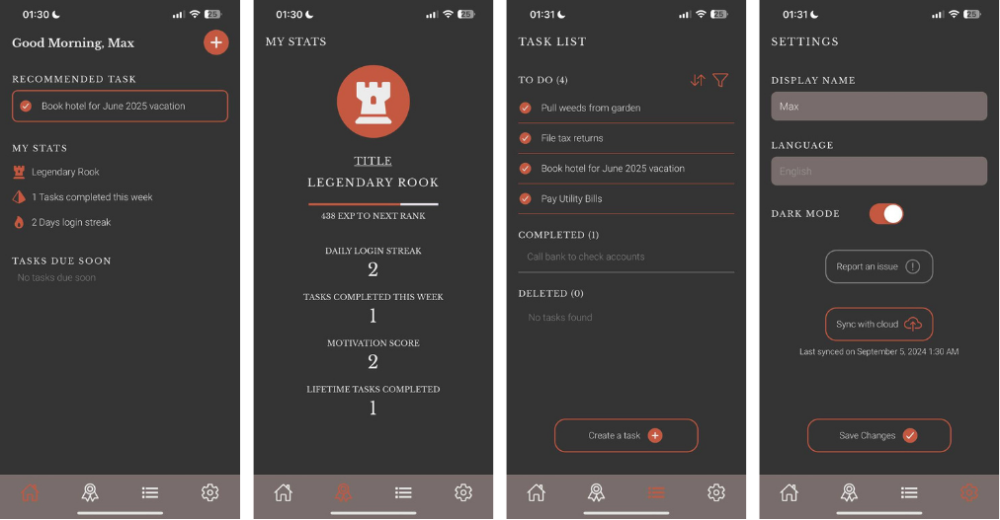
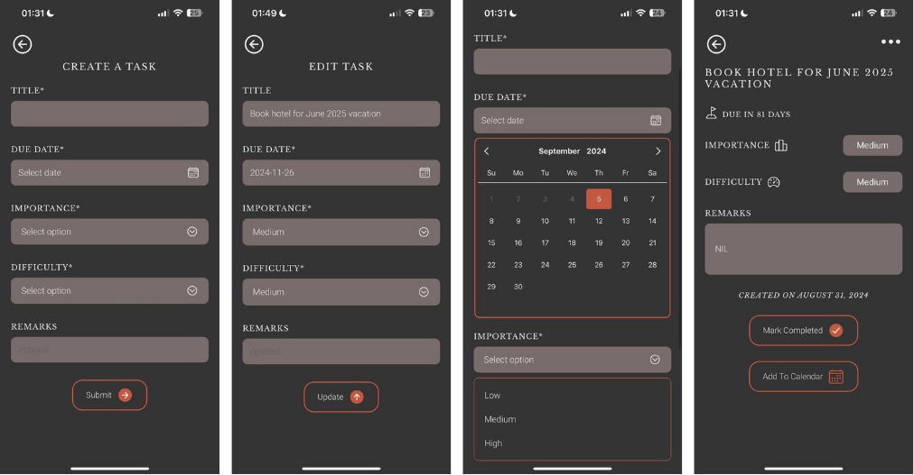

# Taskbull - A Task Manager Mobile Application




## Project Description
Taskbull is a modern task manager application developed as part of a Final Year Project (FYP). It features a robust task prioritization algorithm and includes all essential features to offer users an effective and user-friendly task management experience.


## Application Features
1. Task Recommendation: Utilizes a Task Prioritization Algorithm to recommend tasks based on the Eisenhower Matrix and the user's motivation level.

2. Task Management: Provides essential functions like Create, Edit, View, Delete, Mark as Completed, and Restore tasks. A soft delete approach is used to manage task removal.

3. Levelling System: Incorporates a leveling system inspired by the chess hierarchy, where users earn experience points (EXP) through daily logins, login streaks, and task completions.

4. Cloud Backup: Optimized per session read/write request, user data persists between sessions.

5. Dark/Light Mode: Supports both dark and light themes for user preference.

6. User Feedback Channel: Allows users to provide feedback directly to the developer via a "Report an Issue" button on the Settings page.

7. Add to Calendar: Users can add tasks directly to their calendar with built-in validation to prevent duplicate event creation.

8. Application Feedback: Every user action receives feedback through Toast Messages, ensuring a responsive and interactive experience.


## Application Preview
[IOS & Android] An Expo EAS Preview build of this application be found here:

https://expo.dev/preview/update?message=initial%20commit%20-%20preview%20build&updateRuntimeVersion=1.0.0&createdAt=2024-09-07T21%3A55%3A06.269Z&slug=exp&projectId=2175144c-b7f8-410e-b581-cbdd5d287abe&group=513438aa-3236-47b4-b783-174721b36d48. 

(Expo Go application download needed, https://expo.dev/go)


## How to Run Locally
First, ensure that package-lock.json is deleted.

Next, run this command in the terminal to install dependencies packages.
```
npm install
```
After all packages are installed, bundle the application by running this command in the terminal.
```
npx expo
```
The application should be bundled and waiting.


You can launch the application on your own device using Expo Go (requires download). Read more on https://expo.dev/go.

Alternatively, you can launch the application using an emulator (requires download and setup).


## Testing
1. Unit Testing by Jest. To run Jest test suites, run the following code in the terminal.

```
npm run test
```

2. User Testing using Blackbox (Task-based Testing) and User Acceptance Testing (UAT) with System Usability Scale (SUS) template.
